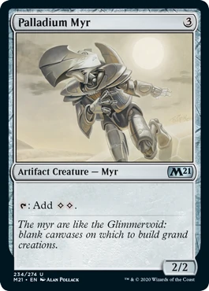
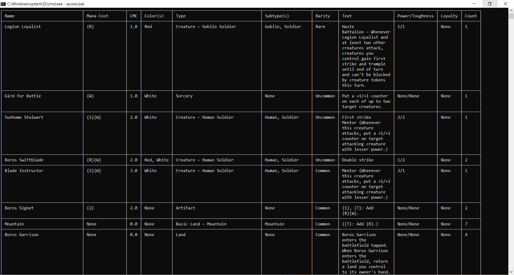
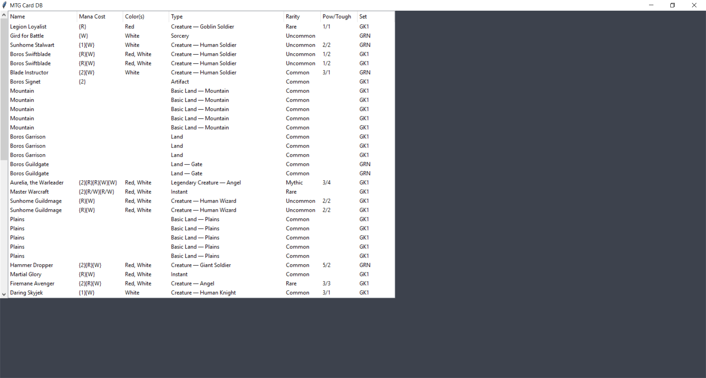

# MTG Database
 A simple, local database of all my Magic: The Gathering Cards

## Anatomy of a card

This is an image of a colorless creature card known as "Palladium Myr". This card is a great example of the layout of MTG cards.

Now explaining everything here would require an in depth explanation of MTG but, as you can see, at the very top, there is a name next to a number. 
This number is how much it costs to cast this creature.

Beneath the image is the term "Artifact Creature - Myr" as well as a symbol towards the right. The first bit is an explanation of the creature, it's type and subtype
(formatted as "{Type} - {Subtype}"). The symbol represents what set this specific card was a part of.

There is also an activatable ability in the large box at the bottom. Underneath that ability is some italic text, this is known as the "flavor text".
This text brings some lore and story to cards.

Finally the last box with "2/2" explains how powerful the card is. It can deal 2 damage (left) and has 2 life (right).

## Goals

#### **WIP goals**

- [x] The first goal is to find a way to properly store the information needed for each card

- [x] The next goal is to simplify the way to input names of cards. This may end up looking like a text file where I manually input names of cards and read that text file as the input.

- [x] Fully implement a view card data system to display details of card in a separate area in the window.

- [ ] Complete search bar implementation.

- [ ] Implement extra column for "In Deck"
#### Stretch goals
- [x] Create or find a way to view the database or somehow search through it.

 

### The end goal will be to make a universal tool that can database MTG cards and can be used by many.

## Tools Used

### This databasing tool will utilize the following PiPy packages: 

*(This list may be appended or changed until I am satisfied with the project)*

| Name            | Command for pip      |
|-----------------|----------------------|
| mtgsdk 1.3.1    | pip install mtgsdk   |
| TinyDB 4.6.1    | pip install tinydb   |
| Tkinter 8.6     | pip install tk       |
| Pillow 8.4.0    | pip install pillow   |
| requests 2.27.1 | pip install requests |

## Running journal

* **2/10/22**
    * **13:07**
        * Initialized active GitHub repo
    * **13:20**
        * Added the ability to read from a .txt file
        * Added example "LIST.txt" file
* **2/17/22**
    * **13:12**
        * Moved from identifying cards with name and year to name, year, and number
        * Added an extra output of the failed card identification
        * Updated output to allow it to have duplicate cards for count of cards
* **2/18/22**
    * **10:44**
        * Collects data more efficiently
        * Created "failed.txt" to collect a list of failed cards
        * Outputs data via tinydb to "mtg.json"
        * Better UX with output to console 
    * **13:16**
        * Imported "rich" library for console output
        * Optimized output to the database for better access later
* **3/1/22**
    * **13:24**
        * Added access.py which will be used to access the database
        * Worked with passing arguments via console (commented out in access.py)
        * Added column "Set" to the table output
* **3/7/22**
    * **10:33**
        * Removed column "Set".
        * Added a "run.bat" file to better print to console.
    * **13:27**
        * Added more features to search by (converted mana cost, WIP colors)
        * Added an "access.bat" file to further the command-line experience.
* **3/15/22**
    * **10:28**
        * Cleaned up code.
        * Allowed search in text for name searches.
* **3/16/22**
    * **12:44**
        * Allowed the option to search for all cards with any of the colors listed or all cards with only the colors listed.
    * **13:20**
        * Completed search function as of now. Able to search by name, colors, converted mana cost, type, subtype, rarity, in text search for description, and power/toughness
        * NOTE: I want to work more on the power/toughness search as you can only search by both at the same time instead of one or the other separately.
* **3/17/22**
    * **12:38**
        * Fixed "main.py" to clear the db before storing data.
* **3/27/22**
    * **18:55**
        * Attempting to use "Tkinter" to create a better visualization of the database.
        * Fully implemented the "Tkinter" use, bar search/sort, into "n_access.py

###Before:

###After:

* **3/29/22**
    * **12:37**
        * Progressed through working getting selections to work.
        * Updated "Goals" section of README
        * Updated previous log in README to include before and after pictures
        * Updated libraries used to include "Tkinter" and remove "rich"
* **4/26/22**
    * **13:23**
        * Fully implemented the "Count" column.
        * Implemented a semi-functioning card view system on selection.
* **5/14/22**
    * **01:23**
        * it is 01:23 in the morning and i just finished hand databasing over 1600 cards. im tired. i wrote a quick proof of concept search bar. ill finish it tomorrow. this will probably not end up on the readme but idk maybe ill upload it im so tired please god.
* **5/14/22**
    * **15:20**
        * Furthered the search bar to allow to search for color, text, and name.
        * Changed "main.py" to download the ".ppm" image file from the URL.
        * Added image viewing capabilities into "n_access.py".
        * THE IMAGE VIEWING IS EXTREMELY WIP AND IS NOT FULLY IMPLEMENTED
* **5/15/22**
    * **14:17**
        * Fully databased all of my MTG card (after 2 all nighters and 3 Red Bulls).
        * Fully implemented image viewing.
        * Cleaned up unnecessary files.
        * Took a nap.
* **5/19/22**
    * **10:56**
        * Fixed search bug with searching a word with a search key in it.
        * Fixed showing last image shown when switching to a Card with no image.
        * Added search support for "Rarity" and "Subtype(s)"
    * **12:37**
        * Fixed a rarity search bug involving where when searching for "common" would return "Common" and "Uncommon" cards.
* **5/29/22**
    * **11:34**
        * Added a file "secmain.py" that goes through and downloads all images of cards. IF YOU DECIDE TO RUN THE FILE MAKE SURE YOU HAVE A LOT OF TIME AND SPACE ITS 37 GB
        * WIP WARNING: "n_access.py" will not work with the images for now but that will be updated later in the day.
    * **11:59**
        * Fixed previous warning. Works as expected now.